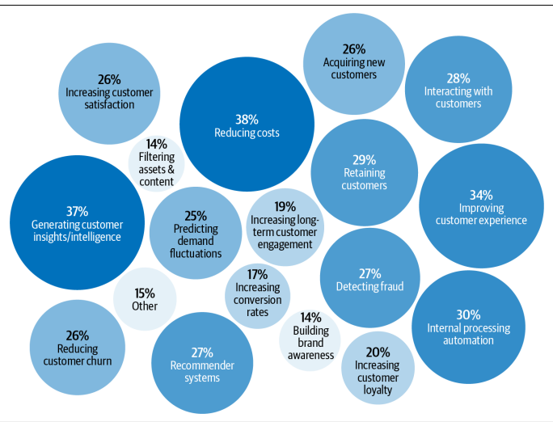

algorithms. MLops are the combination of  building ml and the practices of devops that include the building, deployment monitoring and maintaining the system 

*Ml systems are way beyond the ml* 
when you think about building  ml systems (in production - which is what most ml practitioners are worried about) its much more about the  other procedures than just th training of the ml model. 

**chapter 1**  this chapter gives an insight into:
* if and  when you should use ML?
* what are the use cases of ML systems. (products and enterprise solutions - how they are different)
*  how the machine laerning  systems differ in procuction and researh
*  different stakeholders.
*  other priorities 
   *  latency vs throughput.
   *  data
   *  interpretebility.
   *  Fairnes

 

 

Machine learning is an approach to (1) learn (2) complex patterns from (3) existing
data and use these patterns to make (4) predictions on (5) unseen data
**If and when to use ML system**

1. learn : the system  has the capacity to learn.
2. complex patterns: there are patterns to learn and they are complex
   * there  are comlex patterns, not random, that can be found by training. 
   * pattern, you could model but not too simple that  you sould simply define the patterns yourself
   * complex patterns in speexch recognition and object detection
  

3. Existing data: theres is data or  it is possible to collect  
   *  it is possibl to get the data
   *  sometime models use zero shot training 
   *   sometimes you use the fake it till you make it. manual predictions and use a continually learning model that could learn as the data comes in. 
2. predictions :
   *  most ml problem are the ones that are something that can be framed in the form of predictive problem  - "what will be the output of this ploblem be?", you could do this for all possible conditions irrespective if the output is something of the future, present or the past. 
   *  benefetial if the problem requires large quantity of cheap but approximate predictions. 
   *  if you cant predict the antual output you could frame the part of the problem 
 3. Unseen data shares the same pattern as the trainined data. 
 4. its repeatative  - you can see repeaing patterns that could be learnt.
 5. the cost ofwrong prediction is cheap
 6. it is at scale - costly  to build ml solutions so it makes sense only if it used alot
2. patterns are constantly changing -
3.  imposible to track all the changes and make handwritten rule like spam classifier

Use cases - 

some cosutumer applications
* recommemder sytems and search engines  
* predictive model - next word prediction.
* machine traslation
* virtual assisstants.
* Monitoring 

most ml solutions tend to be use cases in enterprise applications

they would be useful to companies and  improving such ml systems could save companies alot of money. 

imroving the speech recoginition  accuracy by 5%  would not make much difference to the user but improving the resource allocation in google by even 0.1% would save millions of dollars to big companies like google. 
* **customer facing applivctaions are more focused on latency than accuracy**
  

Things in enterprise that matter -
* inventory management, 
* price optimisation
* customer acquisition
* churn predictiion
* fraud detection. 
* Brand monitoring.
  
ML in research vs production

data is dynamic in productions

