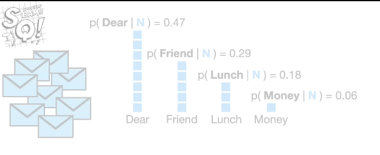
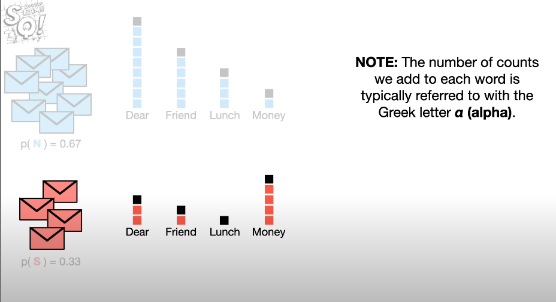
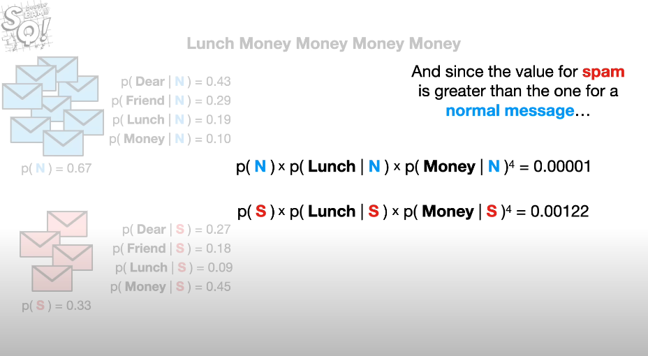

<h1 align = "center"><b>Naive bayes</b></h1>

<a href = "https://www.youtube.com/watch?v=O2L2Uv9pdDA" > StatQuest Naive Bayes, Clearly Explained!!!</a> 

Imagine you are building a spam filter to classify the mails  in your inbox. You have a initial set of mail in which some  are Spam some are not. 
You can find the conditional probabilities of the occurernce of words given that the mail is spam or not, which forms your knowledge base. You use this infomation to predict if mail is spam or not in the furture. 

You create the conditional probabilities by creating word histograms.
 

</img>

<i>img: Word Histograms</i>

 
 

</img>

<i>img: Calculting likelihoods</i>

 
 

Similarly  you do the same for the spam messages too.
The follwing are the conditional probabilities for different words. 

 
 

<b>Normal message</b>
      
      p(Dear | Normal message )    = 0.47
      
      p(Friend | Normal message )  = 0.29
      
      p(Lunch | Normal message )   = 0.18
      
      p(Money | Normal message )   = 0.06

 
 

<b>Spam message</b>
      
      p(Dear | spam message )    = 0.29
      
      p(Friend | spam  message )  = 0.14
      
      p(Lunch | spam message )   = 0.00
      
      p(Money | soam message )   = 0.57

Since they represent individual words, not string of words,  they are known as `likelihoods` not probability. 

We also take an initial estimate of the probabuility of message being a normal message. This inital guess is the prior probability. 

 

      P(Normal message)                   4
         (prior probability) =     _________________    =  0.5
       
                                     4   +    4                   

similrly  the probability of a message being  spam would also be 0.5. 
Now,  lets assume we want to check if `Dear friend` would be spam or not.

      Probability of
      `Dear Friend`      
      occuring in
      Normal message.     =  P(Normal message) x P(Dear | N) x P(Friend | N)
      
                          =  0.5 x 0.47 x 0.29
                          
                          = 0.09
 
 

      Probability of
      `Dear Friend`      
      occuring in
      Spam message.     =  P(Spam message) x P(Dear | S) x P(Friend | S)
      
                          =  0.33 x 0.29 x 0.14
                          
                          = 0.01

0.09 is the score the message  `Dear Friend` gets given that it is Normal. 
The actual probability that the message is Normal is propotional to 0.09. 

Similarly, the probability that the message `Dear Friend` is Spam is  propotional to 0.01

Therefore we assign that the message  is  `Not spam`. 

 
 

<h2 style = "text-align:center">problem with naive bayes</h2>

if we were to find the probability of message `lunch money money money money` to be spam or not, you would find that the 

      P(lunch money money money money | Normal)   = 0.18 x 0.06 ^ 4  = 0.00002
      
      P(lunch money money money money | Spam)     = 0.00 x 0.57 ^ 4  = 0.0 

Here, P(lunch money money money money | Normal) > P(lunch money money money money | Spam), which is wrong. 

Just because the  P(lunch | spam ) is 0  the entire score becomes 0.
To avoid this pseaudo counts are added to all each word in histogram such that the conditional probability  any word is never 0. 
 
 

<<<<<<< HEAD:naive bayes/naive_bayes.md
</img>
=======
</img>
>>>>>>> 8e1272bd1ee802e62eecc2d64fe65eddaa0f910a:naive_bayes.md

 
<i>img: adding pseudocounts<i>

 
 

here we set the `alpha =  1.`

This does  not change our initial guess of P(Normal message) which still remains to be. This does'nt change the number of messages in the inbox. 

Also we need to re-calculate the likelihoods of all the words and the prior probability of the message being spam or not.
 
 

<<<<<<< HEAD:naive bayes/naive_bayes.md
</img>
=======
</img>
>>>>>>> 8e1272bd1ee802e62eecc2d64fe65eddaa0f910a:naive_bayes.md

 
<i>img: Recalculating probabilities.<i>

Now you can note that the problem is fixed. 
 
 

<h2>Why is naive bayes naive?</h2>

The naive bayes disregards the ordering in words and would treat the words as simple bag of words. It does'nt consider the relation between the words or their meaning. 

The naive bayes would give the same score for both 
            `Dear Friend`  and `Friend Dear` 

This still does a great job at spam filtering never the less as it is very difficult to capture all the different word sequences and ordering . 
